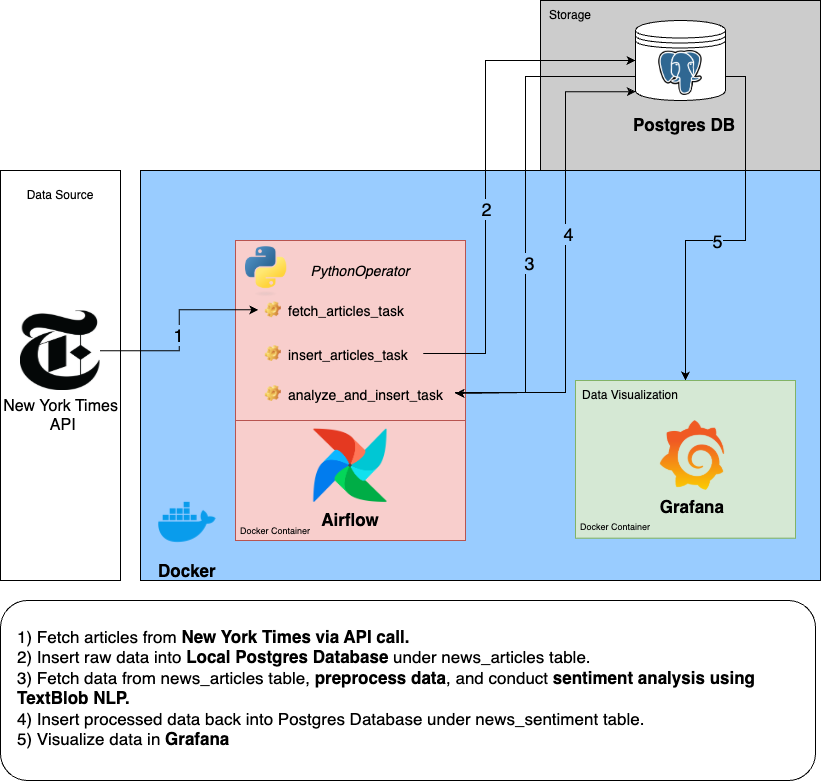

# News-Sentiment-ETL-Pipeline

## Project Overview: News Sentiment ETL Pipeline

The **News Sentiment ETL Pipeline** is a data engineering project designed to automate the extraction, sentiment analysis, and storage of news article data. Using **Apache Airflow**, the pipeline orchestrates the collection of news data, applies sentiment analysis leveraging **TextBlob**, and stores the results in a **PostgreSQL** database. The project runs inside **Docker** containers for easy deployment and scalability, with the exception of the database, which runs separately to ensure data loss prevention. The analyzed sentiment data can be visualized using **Grafana**, allowing users to track sentiment trends over time. This project highlights essential data engineering concepts such as **workflow orchestration**, **containerization**, **automated data ingestion**, and **visualization**, making it a practical demonstration of building efficient ETL workflows with minimal infrastructure costs.

## Architecture Diagram



## Prerequisites

Ensure the following are installed on your local machine before proceeding:

1. **PostgreSQL** (version 12 or higher)
   - Download from [PostgreSQL official site](https://www.postgresql.org/download/)
   - Ensure the PostgreSQL service is running and accessible.
   
2. **Docker & Docker Compose**
   - Install Docker: [Get Docker](https://docs.docker.com/get-docker/)
   - Install Docker Compose: [Get Docker Compose](https://docs.docker.com/compose/install/)
   
3. **Python 3.8+** (optional, for local development)
   - Install from [Python official site](https://www.python.org/downloads/)

## Installation

1. **Clone the repository:**
   ```bash
   git clone https://github.com/yourusername/News-Sentiment-ETL-Pipeline.git
   cd News-Sentiment-ETL-Pipeline

2. **Copy .env.example to .env and update with your credentials:**
    ```bash
    cp .env.example .env

3. **Start the Docker containers:**
    ```bash
    docker-compose up -d

## Usage

1. **Access Airflow:**
   - Open your browser and go to [http://localhost:8080](http://localhost:8080).
   - Login using default credentials (`airflow` / `airflow`).
   - Trigger the DAG to start the sentiment analysis workflow.

2. **Access Grafana for Visualization:**
   - Open [http://localhost:3000](http://localhost:3000).
   - Login using default credentials (`admin` / `admin`).

3. **Inspect the PostgreSQL Database:**
   - Connect using the following command:
     ```bash
     psql -U your_username -d news_db -h localhost
     ```
   - Run queries from the `sql/` directory to analyze sentiment trends.

4. **Shut Down Docker containers:**
    ```bash
    docker-compose down

## Project Structure

````markdown
News-Sentiment-ETL-Pipeline/
├── dags/                # Airflow DAGs for ETL workflows
│   ├── sentiment_dag.py  # DAG for sentiment analysis
├── sql/                 # SQL queries for visualization
│   ├── avg_sentiment_by_date.sql
│   ├── top_sources_by_sentiment.sql
│   └── daily_article_count.sql
├── plugins/             # Custom Airflow plugins
│   ├── __init__.py
│   └── custom_plugin.py
├── logs/                # Airflow logs (excluded in .gitignore)
├── Dockerfile           # Dockerfile for building project images
├── docker-compose.yaml  # Docker Compose for orchestrating containers
├── requirements.txt     # Python dependencies
├── README.md            # Project documentation
├── .env.example         # Example environment variables

````

## Troubleshooting

**1. Airflow UI not accessible at `http://localhost:8080`:**
   - Ensure Docker containers are running using:
     ```bash
     docker ps
     ```
   - Restart the Airflow containers:
     ```bash
     docker-compose restart
     ```

**2. PostgreSQL connection issues:**
   - Check if PostgreSQL is running on your system using:
     ```bash
     psql -U your_username -d news_db -h localhost
     ```
   - Verify `.env` credentials are correct.

**3. No data showing in Grafana:**
   - Ensure Airflow DAGs have successfully processed data.